# 컴퓨터 구조

### 컴퓨터가 이해하는 정보
- **컴퓨터가 이해하는 정보 -: 1) 데이터  2) 명령어**
- 컴퓨터는 결국 명령어를 처리하는 기계다.
- 명령어는 컴퓨터를 실질적으로 움직이는 정보이다.
- 데이터는 명령어를 실행하기 위한 일종의 재료이다.

### 컴퓨터의 핵심 부품
- **컴퓨터의 핵심 부품: 1) CPU  2) 메모리  3) 보조기억장치  4) 입출력장치**
- 세상에는 다양한 종류의 컴퓨터가 있다. 아두이노, 라즈베리 파이와 같은 작은 컴퓨터부터 스마트폰, 노트북, 데스크톱, 서버 컴퓨터에 이르기까지 그 크기와 용도도 제각각이다.
- 하지만 외관과 용도를 막론하고 컴퓨터를 이루는 핵심 부품은 크게 다르지 않다.
>주기억장치에는 크게 RAM(Random Access Memory)과 ROM(Read Only Memory), 두 가지가 있다. 메모리라는 용어는 보통 RAM을 지칭한다. 컴퓨터의 작동 원리를 파악하기 위해 알아야 할 더 중요한 주기억장치는 RAM이다. 따라서 특별한 언급이 없는 한 주기억장치는 RAM이라고 생각해도 무방하다.

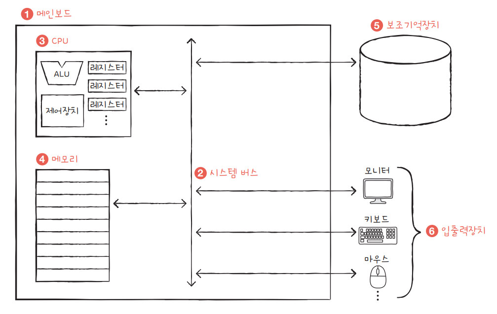

① 메인보드 안에 컴퓨터의 4가지 핵심부품을 부착할 수 있다. 핵심부품을 연결하는 판.

② 메인보드 안에 **시스템 버스**가 있다. 시스템 버스를 통해 4가지 핵심 부품이 정보를 주고 받는다. 다양한 버스가 있지만 가장 핵심이되는 버스가 시스템 버스이다.

③ CPU 내부에는 ALU(산술논리연산장치), 제어장치와 여러 레지스터가 있다. CPU는 메인보드 내 시스템 버스와 연결되어 있다.

④ 메모리는 메인보드 내 시스템 버스와 연결되어 있다.

⑤ 보조기억장치는 메인보드 내 시스템 버스와 연결되어 있다.

⑥ 모니터, 키보드, 마우스 등은 메인보드 내 시스템 버스와 연결되어 있고, 이들을 입출력장치라고 부른다.

--------
### ✅CPU
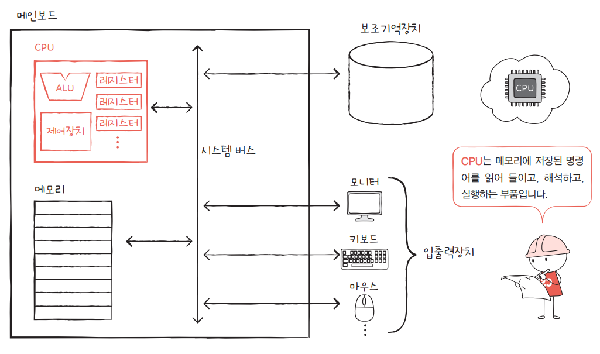
- 컴퓨터의 두뇌
- CPU는 메모리에 저장된 명령어를 읽어 들이고, 읽어 들인 명령어를 해석하고, 실행하는 부품이다.

- **CPU의 핵심 부품: 1) 산술논리연산장치(ALU)  2) 레지스터  3) 제어장치 (Control Unit)**
    1) ALU
        - 계산기(계산만을 위해 존재하는 부품)
        - 컴퓨터 내부에서 수행되는 대부분의 계산은 ALU가 도맡아 수행한다.
    2) 레지스터
        - CPU 내부의 작은 임시 저장 장치
        - 프로그램을 실행하는 데 필요한 값들을 임시로 저장한다.
        - CPU 안에는 여러 개의 레지스터가 존재하고 각기 다른 이름과 역할을 가지고 있다.
    3) 제어장치
        - 제어 신호control signal라는 **전기 신호를 내보내고 명령어를 해석**하는 장치
        - 여기서 제어 신호란 컴퓨터 부품들을 관리하고 작동시키기 위한 일종의 전기 신호
            - CPU가 메모리에 저장된 값을 읽고 싶을 땐 메모리를 향해 '메모리 읽기'라는 제어 신호를 보낸다.
            - CPU가 메모리에 어떤 값을 저장하고 싶을 땐 메모리를 향해 '메모리 쓰기'라는 제어 신호를 보낸다.

**✔️CPU를 구성하는 세 가지 부품의 역할**

간단한 예시를 통해 CPU를 구성하는 세 가지 부품의 역할을 알아보자.

1번지부터 2번지까지 명령어가 저장되어 있다. CPU가 이 두 개의 명령어를 어떻게 실행하는지 살펴보자.

**01** 제어장치는 1번지에 저장된 명령어를 읽어 들이기 위해 메모리에 ‘메모리 읽기’ 제어 신호를 보낸다.

**02**

① 메모리는 1번지에 저장된 명령어를 CPU에 건네주고, 이 명령어는 레지스터에 저장된다.

② 제어장치는 읽어 들인 명령어를 해석한 뒤 3번지와 4번지에 저장된 데이터가 필요하다고 판단한다.

③ 제어장치는 3번지와 4번지에 저장된 데이터를 읽어 들이기 위해 메모리에 ‘메모리 읽기’ 제어 신호를 보낸다.

**03**

① 메모리는 3번지와 4번지에 저장된 데이터를 CPU에 건네주고, 이 데이터들은 서로 다른 레지스터에 저장된다.

② ALU는 읽어 들인 데이터로 연산을 수행한다.

③ 계산의 결괏값은 레지스터에 저장된다. 계산이 끝났다면 첫 번째 명령어의 실행은 끝난다.

**04**

① 제어장치는 2번지에 저장된 다음 명령어를 읽어 들이기 위해 메모리에 ‘메모리 읽기’ 제어 신호를 보낸다.

② 메모리는 2번지에 저장된 명령어를 CPU에 건네주고, 이 명령어는 레지스터에 저장된다.

③ 제어장치는 이 명령어를 해석한 뒤 메모리에 계산 결과를 저장해야 한다고 판단한다.

④ 제어장치는 계산 결과를 저장하기 위해 메모리에 ‘메모리 쓰기’ 제어 신호와 함께 계산 결과인 220을 보낸다. 메모리가 계산 결과를 저장하면 두 번째 명령어의 실행도 끝난다.
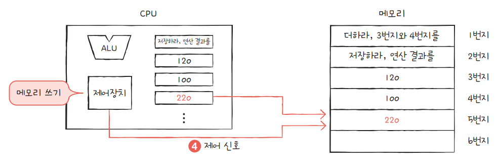

**✔️CPU 요약**
- CPU는 메모리에 저장된 값을 읽어 들이고, 해석하고, 실행하는 장치다.
- CPU 내부에는 ALU, 레지스터, 제어장치가 있다.
- ALU는 계산하는 장치, 레지스터는 임시 저장 장치, 제어장치는 제어 신호를 발생시키고 명령어를 해석하는 장치다.
--------

### ✅메모리
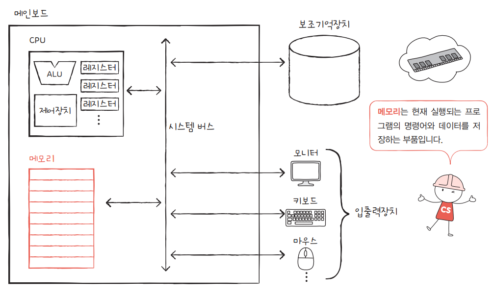
- 모든 프로그램은 데이터와 명령어로 이루어져 있다.
- 메모리는 **현재 실행되는 프로그램**의 명령어와 데이터를 저장하는 부품이다.
- 즉, 프로그램이 실행되려면 반드시 메모리에 저장되어 있어야 한다.
- 참고)
    - 현재 실행되는 프로그램 = 프로세스 
    - 사실 실행되는 모든 프로그램의 모든 데이터와 명령어가 다 메모리에 저장될 필요는 없음 > **페이징**
    - 실행되고 있지 않은 프로그램은 보조기억장치에 있다.

- 컴퓨터가 빠르게 작동하기 위해서는 메모리 속 명령어와 데이터가 중구난방으로 저장되어 있으면 안 된다. 저장된 명령어와 데이터의 위치는 정돈되어 있어야 한다. 그래서 메모리에는 저장된 값에 빠르고 효율적으로 접근하기 위해 주소address라는 개념이 사용된다. 현실에서 우리가 주소로 원하는 위치를 찾아갈 수 있듯이 컴퓨터에서도 주소로 메모리 내 원하는 위치에 접근할 수 있다.
- 메모리에 저장된 값의 위치는 주소로 알 수 있다.
--------
### ✅보조기억장치
앞서 메모리는 실행되는 프로그램의 명령어와 데이터를 저장한다고 했지만, 이 메모리는 두 가지 치명적인 약점이 있다.
첫 째는 가격이 비싸 저장 용량이 적다는 점이고, 둘 째는 전원이 꺼지면 저장된 내용을 잃는다는 점이다(휘발성).

컴퓨터로 작업하는 도중에 전원이 꺼지면 작업 내역을 잃게 되는 이유는 실행 중인 프로그램들은 메모리에 저장되는데, 메모리는 전원이 꺼지면 저장된 내용이 날아가기 때문이다.

이에 메모리보다 크기가 크고 전원이 꺼져도 저장된 내용을 잃지 않는 메모리를 보조할 저장 장치가 필요하게 되었는데, 이 저장 장치가 보조기억장치이다.

- 하드 디스크, SSD, USB 메모리, DVD, CD-ROM과 같은 저장 장치가 보조기억장치의 일종이다.
- 컴퓨터 전원이 꺼져도 컴퓨터에 파일이 남아 있었던 이유는 우리가 파일을 보조기억장치에 저장했기 때문이다.
- **메모리가 현재 ‘실행되는’ 프로그램을 저장한다면, 보조기억장치는 ‘보관할’ 프로그램을 저장한다.**

--------
### ✅입출력장치
입출력장치는 마이크, 스피커, 프린터, 마우스, 키보드처럼 **컴퓨터 외부에 연결되어 컴퓨터 내부와 정보를 교환하는 장치를 의미한다.**
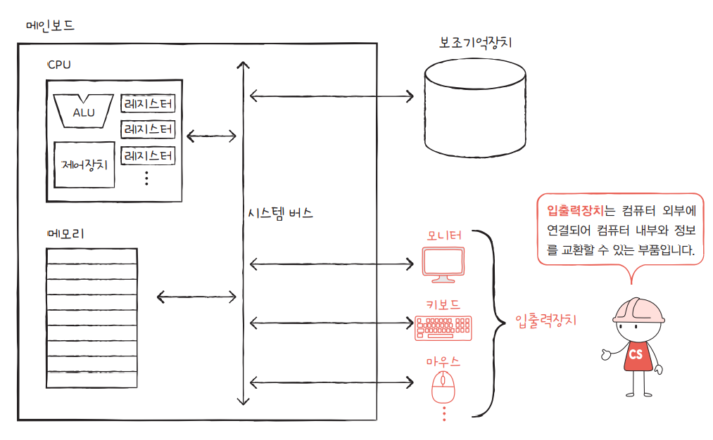

> 🗣️“보조기억장치로 알고 있었던 하드 디스크, USB 메모리, CD-ROM도 ‘컴퓨터 외부에 연결되어 컴퓨터 내부와 정보를 교환할 수 있는 장치’로 볼 수 있지 않나? 그러면 보조기억장치도 결국 입출력장치 아닌가?”

> 이는 매우 좋은 지적이고 맞는 말이다. 보조기억장치는 관점에 따라 입출력장치의 일종으로 볼 수 있다. 실제로 보조기억장치와 입출력장치를 ‘컴퓨터 주변에 붙어있는 장치’라는 의미에서 주변장치peripheral device라 통칭하기도 한다. 다만 보조기억장치는 모니터, 마우스, 키보드와 같은 일반적인 입출력장치에 비해 메모리를 보조한다는 특별한 기능을 수행하는 입출력장치이다.
 보조기억장치와 입출력장치는 구분해서 생각하되, ‘완전히 다른 부품은 아니다’ 정도로만 생각해도 컴퓨터 공학 전공서를 읽는 데 어려움은 없다.
--------
### ✅메인보드
- 지금까지 설명한 컴퓨터의 핵심 부품들은 모두 메인보드main board라는 판에 연결된다. 메인보드는 마더보드mother board라고도 부른다.
- 메인보드에는 앞서 소개한 부품을 비롯한 여러 컴퓨터 부품을 부착할 수 있는 슬롯과 연결 단자가 있다.
- 메인보드에 연결된 부품들은 서로 정보를 주고받을 수 있는데, 이는 메인보드 내부에 버스bus라는 통로가 있기 때문이다.
- 컴퓨터 내부에는 다양한 종류의 통로, 즉 **버스**가 있다.
- 하지만 여러 버스 가운데 컴퓨터의 네 가지 핵심 부품을 연결하는 가장 중요한 버스는 시스템 버스system bus이다.
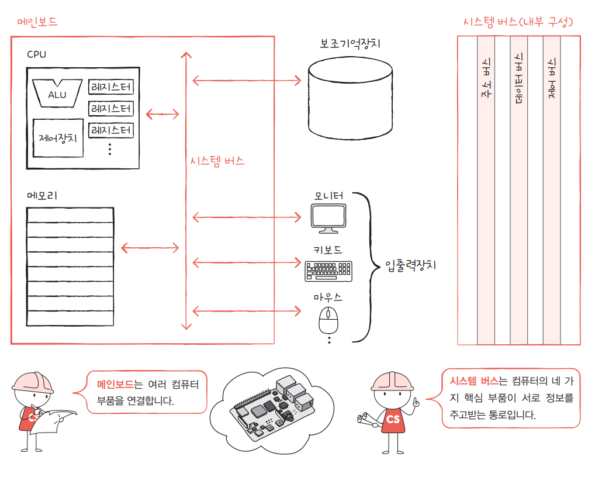

### ✅시스템 버스
- 시스템 버스는 주소 버스, 데이터 버스, 제어 버스로 구성되어 있다.
    - 주소 버스address bus: **주소**를 주고받는 통로
    - 데이터 버스data bus: **명령어와 데이터**를 주고받는 통로
    - 제어 버스control bus: **제어 신호**를 주고받는 통로

시스템 버스를 조금 더 자세히 이해하기 위해 앞서 설명한 CPU의 작동 예시를 다시 한번 보자.

CPU가 메모리 속 명령어를 읽어 들이기 위해 제어장치에서 ‘메모리 읽기’라는 신호를 내보낸다고 했다.

그런데 사실 CPU가 메모리를 읽을 땐 제어 신호만 내보내지 않는다. 실제로는

① 제어 버스로 ‘메모리 읽기’ 제어 신호를 내보내고,

② 주소 버스로 읽고자 하는 주소를 내보낸다.

③ 그러면 메모리는 데이터 버스로 CPU가 요청한 주소에 있는 내용을 보낸다.

그리고 메모리에 어떤 값을 저장할 때도

① CPU는  데이터 버스를 통해 메모리에 저장할 값을,

② 주소 버스를 통해 저장할 주소를,

③ 제어 버스를 통해 ‘메모리 쓰기’ 제어 신호를 내보낸다.

--------
**✔️컴퓨터 핵심 부품 요약**

- 메모리는 현재 실행되는 프로그램의 명령어와 데이터를 저장하는 부품
- CPU는 메모리에 저장된 명령어를 읽어 들이고, 해석하고, 실행하는 부품
- 보조기억장치는 전원이 꺼져도 보관할 프로그램을 저장하는 부품
- 입출력장치는 컴퓨터 외부에 연결되어 컴퓨터 내부와 정보를 교환할 수 있는 부품
- 시스템 버스는 컴퓨터의 네 가지 핵심 부품들이 서로 정보를 주고 받는 통로
--------

## 명령어 사이클
- CPU는 프로그램 속 명령어들을 일정한 주기를 반복하며 실행한다.
- 이 주기를 **명령어 사이클**이라고 한다.
- 인출 사이클 : 일단 CPU는 메모리에 저장된 값을 갖고 온다.
- 실행 사이클 : 갖고 온 내용을 실행
- 인출하더라도 바로 실행이 불가한 경우가 있다. 실행을 위해 몇 번 더 메모리 접근해야할 수 있다. 이런 경우 간접 사이클에 돌입하며, 실행 가능하게 되면 다시 실행 사이클로 돌아간다.
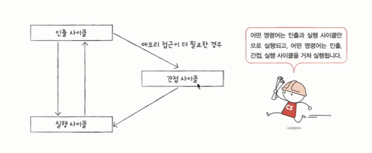
이러한 정해진 흐름을 끊어버리는 것 = 인터럽트

## 인터럽트
- CPU가 꼭 주목해야 할 때, CPU가 얼른 처리해야 할 다른 작업이 생겼을 때 발생한다.

### ✅ 동기 인터럽트(예외)
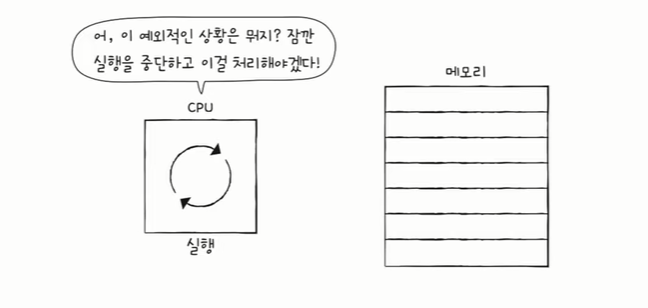
- CPU가 예기치 못한 상황을 접했을 때 발생
- 예) 나누기 0, 디버깅, 실행할 수 없는 명령 등
- 4개의 종류 : **1) 폴트, 2) 트랩, 3) 중단, 4) 소프트웨어 인터럽트**

### ✅ 비동기 인터럽트(하드웨어 인터럽트)
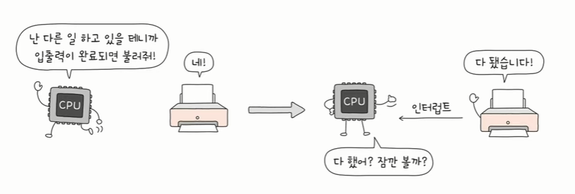
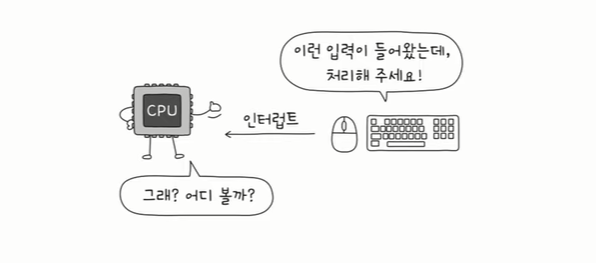
- 주로 입출력장치에 의해 발생한다.
- 동기 인터럽트와 달리 문제가 발생했다기보다는 **알림**과 같은 역할을 한다.
- 입출력 작업 도중에도 효율적으로 명령어를 처리하기 위해 하드웨어 인터럽트를 사용한다.
- 입출력장치는 CPU에 비해 느리다.
- 인터럽트가 없다면 CPU는 프린트 완료 여부를 확인하기 위해 주기적으로 확인해야 한다.
- 인터럽트가 있다면 입출력 작업 동안 CPU는 다른 일을 할 수 있다.

### ✅️인터럽트 처리 순서
(인터럽트 종류룰 막론하고 순서는 대동소이)

    1) 입출력장치는 CPU에 인터럽트 요청 신호를 보낸다.
    2) CPU는 실행 사이클이 끝나고 명령어를 인출하기 전 항상 인터럽트 여부를 확인한다.
    3) CPU는 인터럽트 요청을 확인하고 인터럽트 플래그를 통해 현재 인터럽트를 받아들일 수 있는지 여부를 확인한다.
    4) 인터럽트를 받아들일 수 있다면 CPU는 지금까지의 작업을 백업한다.
    5) CPU는 인터럽트 벡터를 참조하여 인터럽트 서비스 루틴을 실행한다.
    6) 인터럽트 서비스 루틴 실행이 끝나면 4)에서 백업해 둔 작업을 복구하여 실행을 재개한다.

**1) 입출력장치는 CPU에 인터럽트 요청 신호를 보낸다.**
- **인터럽트 요청 신호 :** CPU에게 지금 끼어들어도 되는지 물어보는 것

**2) CPU는 실행 사이클이 끝나고 명령어를 인출하기 전 항상 인터럽트 여부를 확인한다.**

**3) CPU는 인터럽트 요청을 확인하고 인터럽트 플래그를 통해 현재 인터럽트를 받아들일 수 있는지 여부를 확인한다.**
- 현재 받아들일 수 있다면 CPU는 받아들이고 인터럽트 처리한다.
- 받아들일 수 없다면 해당 인터럽트 처리하지 않는다.
- 너어어어무 중요하고 긴급하면 인터럽트 플래그로도 막을 수 없다 > NMI(num maskable interrupt. 막을 수 없는 인터럽트)

**4) 인터럽트를 받아들일 수 있다면 CPU는 지금까지의 작업을 백업한다.**
- 인터럽트 서비스 루틴 시작 전 기존 작업 정보를 저장 > **스택**에 백업

**5) CPU는 인터럽트 벡터를 참조하여 인터럽트 서비스 루틴을 실행한다.**
- 받아들이기로 했다면,
- **인터럽트 서비스 루틴**이라는 "프로그램" 실행
- 인터럽트가 발생했을 때 해당 인터럽트를 어떻게 처리해야할지 쓰여 있음
- 키보드가 요청한 경우 이렇게 해라 / 마우스가 ..

- 인터럽트 서비스 루틴도 프로그램이기에 메모리에 저장된다.
- 인터럽트를 보내는 주체에 따라서 각기 다른 인터럽트 서비스 루틴의 시작 주소를 가지고 있다.

- 인터럽트를 보낼 수 있는 주체는 다양하다. 보드, 마우스, 프린터기 등
- 인터럽트 서비스 루틴의 시작 주소가 각자 다르기 때문에 그 주소를 알고 주체를 구분하기 위한 정보 = 인터럽트 벡터
- **인터럽트 벡터**: 각각의 인터럽트를 구분하기 위한 정보
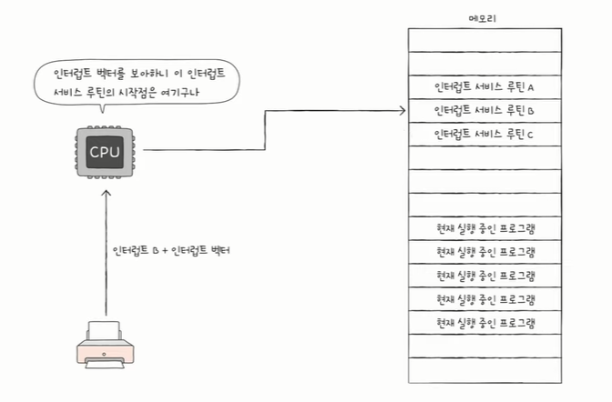
- 입출력장치는 **인터럽트 요청 신호 + 인터럽트 벡터** 같이 데이터 버스를 통해 보닌다.
- CPU가 인터럽트를 처리한다 = 인터럽트 서비스 루틴을 실행하고 본래 수행하던 작업으로 다시 되돌아온다.

**6) 인터럽트 서비스 루틴 실행이 끝나면 4)에서 백업해 둔 작업을 복구하여 실행을 재개한다.**

**✔️정리**
- 인터럽트 요청 신호: CPU의 작업을 방해하는 인터럽트에 대한 요청
- 인터럽트 플래그: 인터럽트 요청 신호를 받아들일지 무시할지를 결정하는 비트
- 인터럽트 벡터: 인터럽트 서비스 루틴의 시작 주소를 포함하는 인터럽트 서비스 루틴의 식별 정보
- 인터럽트 서비스 루틴: 인터럽트를 처리하는 프로그램
-----
**이미지 출처 및 참고 내용**

[컴퓨터 공학 기초 강의] 2강. 컴퓨터 구조의 큰 그림
<https://www.youtube.com/watch?v=Oga3_Rl1kxQ&list=PLVsNizTWUw7FCS83JhC1vflK8OcLRG0Hl&index=4>

[컴퓨터 공학 기초 강의] 11강. 명령어 사이클과 인터럽트
<https://www.youtube.com/watch?v=3Yz7OnVUM28&list=PLVsNizTWUw7FCS83JhC1vflK8OcLRG0Hl&index=13>
