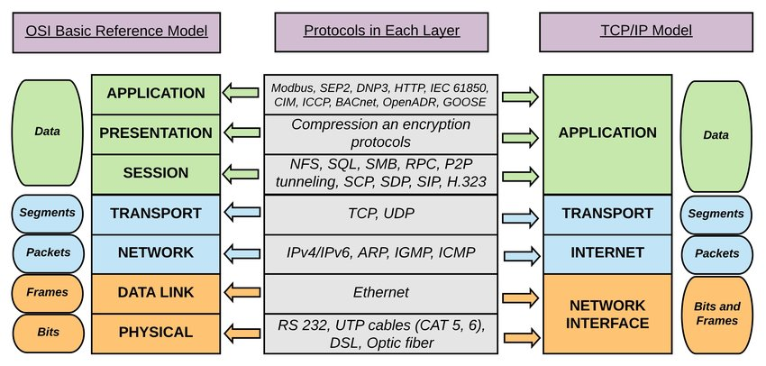

## TCP/IP 4계층 모델

 - `인터넷 프로토콜 스위트(internet protocol suite)`란 인터넷에서 컴퓨터들이 서로 정보를 주고 받는데 쓰이는 프로토콜의 집합
 - `인터넷 프로토콜 스위트(internet protocol suite)`를 `TCP/IP(Transmission Control Protocol) 4계층 모델`이나 `OSI 7계층 모델`로 설명함.

### 1. 계층 구조
 - TCP/IP 계층은 4개의 Layer로 이루어져 있으며 OSI 7 Layer와 많이 비교한다.
 - 이 계층 모델은 네트워크에서 사용되는 통신 프로토콜의 집합으로 계층들은 프로토콜의 네트워킹 범위에 따라 네 개의 추상화 계층으로 구성된다.

[The logical mapping between OSI basic reference model and the TCP/IP stack.](#tcp-ip-and-osi-layer)
> 위에서 그림에서 볼 수 있는 계층들은 특정 계층이 변경되었을 때 다른 계층이 영향을 받지 않도록 설계되었다.

##### **1. 애플리케이션(Application) 계층**

- FTP, HTTP, SSH, SMTP, DNS 등 응용 프로그램이 사용되는 프로토콜 계층으로 웹 서비스, 이메일 등 서비스를 실질적으로 사람들에게 제공하는 층이다.
> - `FTP`: 장치와 장치 간의 파일을 전송하는 데 사용되는 표준 통신 프로토콜
> - `SSH`: 보안되지 않은 네트워크에서 네트워크 서비스를 안전하게 운영하기 위한 암호화 네트워크 프로토콜
> - `HTTP`: World Wide Web을 위한 데이터 통신의 기초이자 웹 사이트를 이용하는 데 쓰는 프로토콜
> - `SMTP`: 전자 메일 전송을 위한 인터넷 표준 통신 프로토콜
> - `DNS`: 도메인 이름과 IP 주소를 매핑해주는 서버.

##### **2. 전송(Transport) 계층**

- 송신자와 수신자를 연결하는 통신 서비스를 제공하며 연결 지향 데이터 스트림 지원, 신뢰성, 흐름 제어를 제공할 수 있으며 Application 계층과 Internet 계층 사이의 데이터가 전달될 때 중계 역할을 한다.
- 대표적으로 TCP, UDP가 있다.
> - `TCP`: 패킷 사이의 순서를 보장하고 연결지향 프로토콜을 사용해 연결하여 신뢰성을 구축해 수신 여부를 확인하며 `가상회선 패킷 교환 방식`을 사용한다.
> - `UDP`: 순서를 보장하지 않고 수신 여부를 확인하지 않으며 단순히 데이터만 주는 `데이터그램 패킷 교환 방식`을 사용한다.
> > **가상회선 패킷 교환 방식**이란
> > - 각 패킷에는 가상회선 식별자(VCI)가 포함되며 모든 패킷을 전송하면 가상 회선이 해제되고 패킷들은 전송된 순서대로 도착하는 방식을 말한다.
> > => 데이터 그램은 패킷마다 라우터가 경로를 선택하지만 가상회선 방식은 경로를 설정할 때 한번만 수행한다. (연결 지향형)
 
[virtual-packet-switching](#virtual-packet-switching)

> > **데이터그램 패킷 교환 방식**이란
> > - 패킷이 독립적으로 이동하며 최적의 경로를 선택하여 가는데, 하나의 메세지에서 분할된 여러 패킷은 서로 다른 경로로 전송될 수 있으며 도착한 순서가 다를 수 있는 방식을 말한다.
> > => 송신 측에서 전송한 순서와 수신 측에 도착한 순서가 다를 수 있다. (비연결 지향형)
 
[datagram-packet-switching](#datagram-packet-switching)

> **TCP 연결 성립 과정**
> - TCP는 신뢰성을 확보할 때, `3-way handshake`라는 작업을 진행 한다.
> 1. SYN(Synchronization) 단계
> - client는 server에 클라이언트의 ISN(Initial Sequence Number)을 담아 SYN을 보낸다.
> - ISN은 새로운 TCP 연결의 첫번째 패킷에 할당된 임의의 시퀀스 번호를 말하며 장치마다 다를 수 있다. 초기 네트워크 연결 시 할당된 32비트 고유 시퀀스 번호이다.
> 2. SYN + ACK(Acknowledgement) 단계
> - 서버는 클라이언트의 SYN을 수신하고 서버의 ISN을 보내며 승인번호로 클리이언터의 ISN + 1을 보낸다.
> 3. ACK 단계
> - 클라이언트는 서버의 ISN + 1한 값인 승인번호를 담아 ACK를 서버에 보낸다.
>  
=> 이렇게 `3-way handshake`과정 이후 신뢰성이 구축되고 데이터 전송을 시작한다.
> - `TCP`는 이 과정이 있기에 신뢰성이 있는 계층이며, `UDP`는 이 과정이 없기 때문에 신뢰성이 없는 계층이다.

> **TCP 연결 해제 과정**
> - TCP가 연결을 해제할 때는 `4-way handshake`과정이 발생한다.
> 1. 먼저 클라이언트가 연결을 닫으려고 할 때 `FIN`으로 설정된 세그먼트를 보낸다. 그리고 클라이언트는 `FIN_WAIT_1` 상태로 들어가고 서버의 응답을 기다린다.
> 2. 서버는 클라이언트로 `ACK`라는 승인 세그먼트를 보낸다. 그리고 `CLOSE_WAIT`상태에 들어간다. 클라이언트가 세그먼트를 받으면 `FIN_WAIT_2` 상태에 들어간다.
> 3. 서버는 `ACK`를 보내고 일정 시간 이후에 클라이언트에 `FIN`이라는 세그먼트를 보낸다.
> 4. 클라이언트는 `TIME_WAIT`상태가 되고 다시 서버로 `ACK`를 보내서 서버는 `CLOSED`상태가 된다. 이후 클라이언트는 어느 정도의 시간을 대기한 후 연결이 닫히고 클라이언트와 서버의 모든 자원의 연결이 해제된다.
>  
>  - **그냥 연결을 닫으면 되지 왜 굳이 일정 시간 뒤에 닫을까?**
>  
> 1. 지연 패킷이 발생할 경우 대비 하기 위해서. 패킷이 뒤늦게 도착해 처리하지 못하면 데이터 무결성 문제가 발생한다.
> 2. 두 장치가 연결이 닫혔는지 확인 하기 위해서. 만약 `LAST_ACK`상태에서 닫히면 다시 새로운 연결을 하려고 할 때 장치는 계속 `LAST_ACK`로 되어 있기 때문에 접속 오류가 나타난다.
>  
> => `TIME_WAIT`가 중요한 이유. 소켓이 소멸되지 않고 일정 시간 유지되는 상태를 말하며 지연 패킷 등의 문제점을 해결하는데 쓰인다. OS마다 조금씩 다를수 있으며, 우분투에서는 60초, WINDOW에서는 4분으로 설정되어 있다.

** Transport 계층의 패킷을 `segment(세그먼트)`라고 한다.

Reference

<a name="tcp-ip-and-osi-layer">https://www.researchgate.net/figure/The-logical-mapping-between-OSI-basic-reference-model-and-the-TCP-IP-stack_fig2_327483011</a>
<a name="virtual-packet-switching">https://woovictory.github.io/2018/12/28/Network-Packet-Switching-Method/#:~:text=%EA%B0%80%EC%83%81%ED%9A%8C%EC%84%A0%20%ED%8C%A8%ED%82%B7%20%EA%B5%90%ED%99%98%20%EB%B0%A9%EC%8B%9D&text=(%EC%97%B0%EA%B2%B0%20%EC%A7%80%ED%96%A5%ED%98%95)%20%EA%B0%81%20%ED%8C%A8%ED%82%B7%EC%97%90%EB%8A%94,%EB%95%8C%20%ED%95%9C%20%EB%B2%88%EB%A7%8C%20%EC%88%98%ED%96%89%ED%95%9C%EB%8B%A4.</a>
<a name="datagram-packet-switching">https://woovictory.github.io/2018/12/28/Network-Packet-Switching-Method/#:~:text=%EA%B0%80%EC%83%81%ED%9A%8C%EC%84%A0%20%ED%8C%A8%ED%82%B7%20%EA%B5%90%ED%99%98%20%EB%B0%A9%EC%8B%9D&text=(%EC%97%B0%EA%B2%B0%20%EC%A7%80%ED%96%A5%ED%98%95)%20%EA%B0%81%20%ED%8C%A8%ED%82%B7%EC%97%90%EB%8A%94,%EB%95%8C%20%ED%95%9C%20%EB%B2%88%EB%A7%8C%20%EC%88%98%ED%96%89%ED%95%9C%EB%8B%A4.</a>

